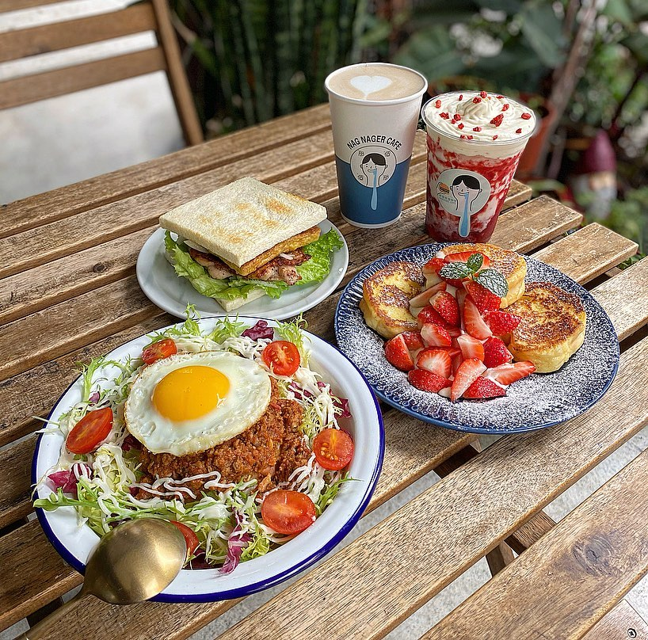
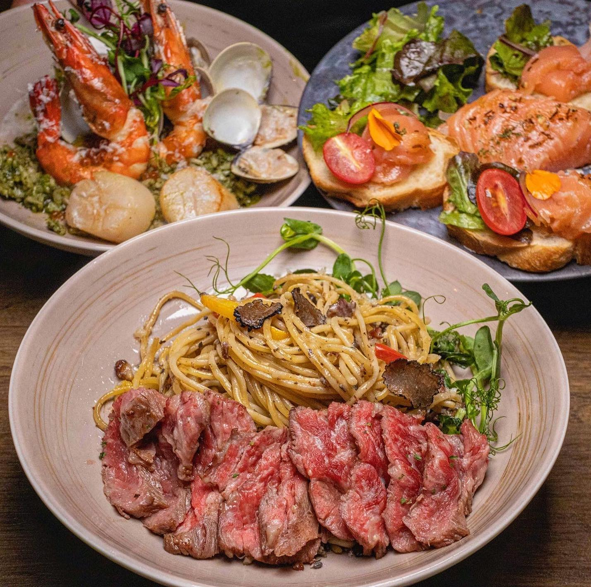
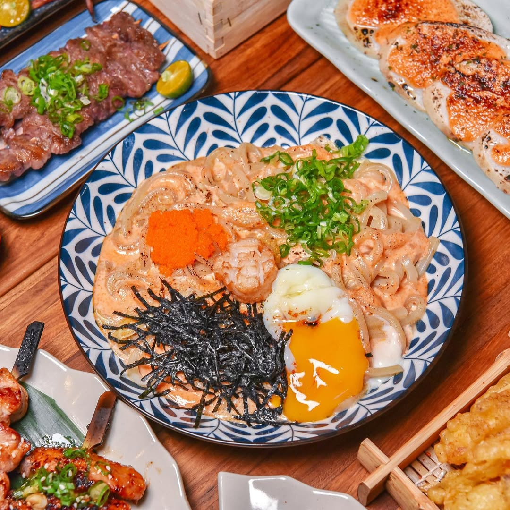
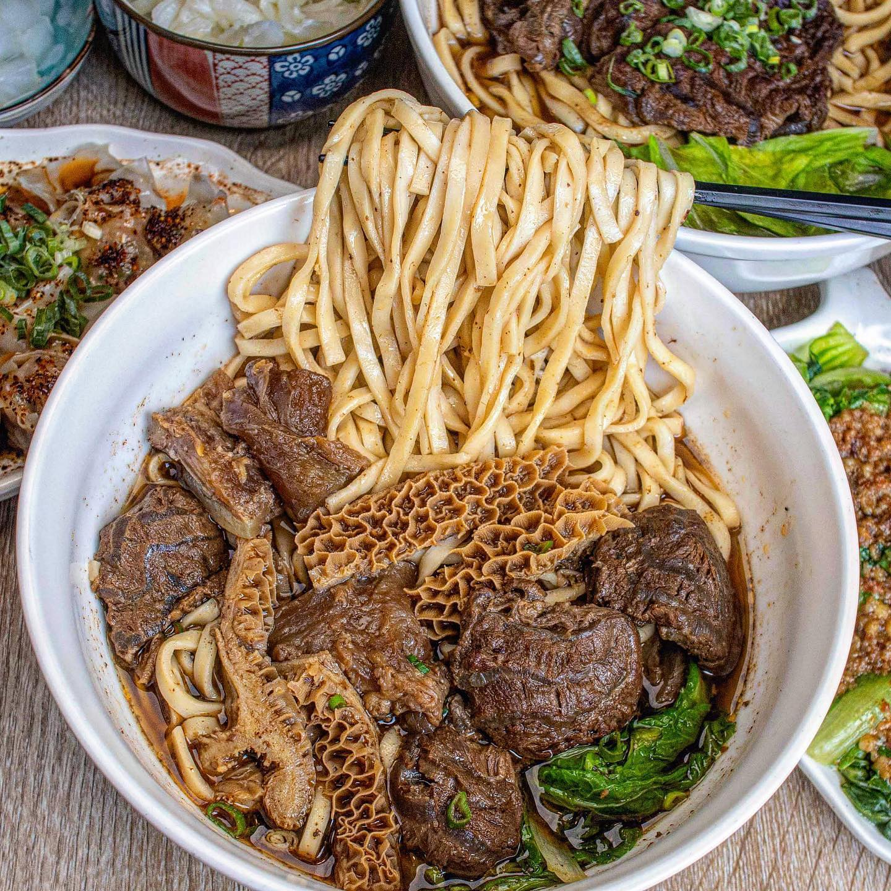

# Exotic Cuisine Classification Dataset
## Datasets
This dataset was co-created by 莊婷馨(111550057) and 謝詠晴(111550113).
### Dataset Compositions
This dataset consists of 2000 images, all in JPG format, across four categories, with 500 images per category, including café/brunch, Italian, Japanese, and Taiwanese food images sourced from both Instagram posts and photos taken by ourselves. I randomly split the dataset into 80% for training and 20% for testing.

Initially, we also considered Thai and Korean categories, but we ultimately selected these four because they are among the most common types of food found in Instagram posts.
<br><br>**P.S.** We only used the first 500 photos from the Taiwanese category.
### Data Source and External References
We used Instaloader to scrape food-related posts from various Instagram accounts, including _maplechen.foodie, evelyn_enjoyfood, pc.foodie, casey.foods, whynot_eating, gourmet__cindy, lexiedaily85, tainanfood_dczhi, ariyo_foodie, cow_55555, kiwi_food.life, foodiegg_chiayi, taiwanfoodeat, tiger.eat,_ and others. Additionally, we incorporated food photos taken by ourselves in daily life to enhance the dataset’s diversity and originality.
### Dataset Structure
```
ai_capstone_hw1/
	├── cafebrunch/
	│   ├── cb_1.jpg
	│   ├── cb_2.jpg
	│   ├── cb_3.jpg
	│   ├── ...
	├── italian/
	│   ├── i_1.jpg
	│   ├── i_2.jpg
	│   ├── i_3.jpg
	│   ├── …
	├── …
```
### Data Collection Process
1. Scraping Instagram Posts:
Using Instaloader, we crawled posts from selected Instagram food accounts. For each post, we examined its caption hashtags to determine whether it matched any of our predefined categories. If a post contained a hashtag corresponding to one of these categories, we downloaded the first image from that post and stored it in the appropriate category folder.
2. Self-Captured Photos:
These images were manually reviewed and classified into the corresponding categories.
3. Data Cleaning:
We conducted a manual review of the collected images. If any images appeared to be mislabeled or significantly deviated from their intended category, they were manually removed to prevent bias and improve classification accuracy.
### Dataset Samples
<table>
  <tr>
    <td><br>café/brunch</td>
    <td><br>Italian</td>
    <td><br>Japanese</td>
    <td><br>Taiwanese</td>
  </tr>
<table>

